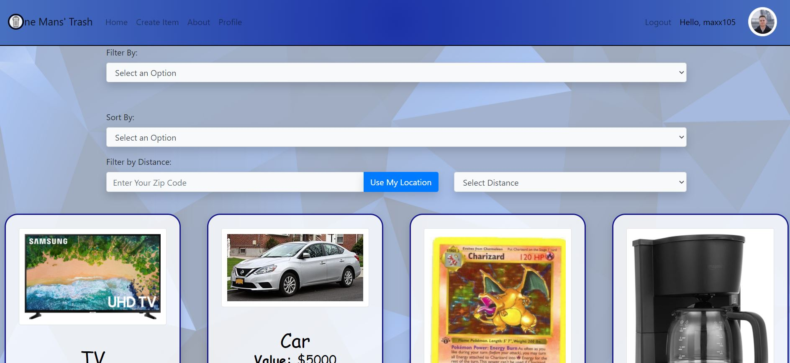

# One Man's Trash 

UCI Boot Camp Project 03 - One Man's Trash

Click [here](https://one-mans-trash.herokuapp.com/) to open the deployed Github pages application.

## Description
This was the final project for the full stack web development program at UC Irvine, in which the goal was to create an application that has real world value. The criteria for this project included the use of REACTJS, Node, MYSQL or MongoDB, and the use of two new technologies.

## Table of Contents 
* [Technologies](#Technologies) 
* [Usage](#Usage)
* [License](#License)
* [Badges](#Badges)
* [Test](#Test)
* [Questions](#Questions)

## Technologies
* This application is written using the React.js javascript framework as well as JSX.
* It used the Router component in React.
* Mongo and Mongoose ORM for database storage.
* It uses CSS/Bootstrap for styling.
* It requires node.js to run it.
* Deployed on Heroku.
* Passport for user authentication.
* JWT for the creation of a webaccess token.
* AWS S3 Buckets for image hosting.
* Zipcode API https://www.zipcodeapi.com/API & https://freegeoip.app/

## Usage
If using from the Github pages deployed application, just go to the deployed application's [link](https://one-mans-trash.herokuapp.com/). This application is a marketplace If running off a local server, first do an npm install then run the server by running the "npm start" command in a gitbash terminal. This will initialize the React app.

## License
ISC

## Badges

 

## Tests
No tests are currently in place for this project. 

## Questions
For any questions, feel free to contact one of the contributors either 
* Maxx at maxxsanner105@gmail.com
* Fernando at fangulo82@gmail.com
* Michael at trujillom9@gmail.com
* Jonathan at JonathanHui.hk@gmail.com
